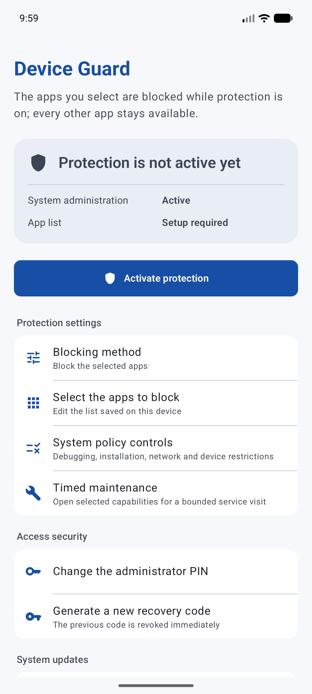
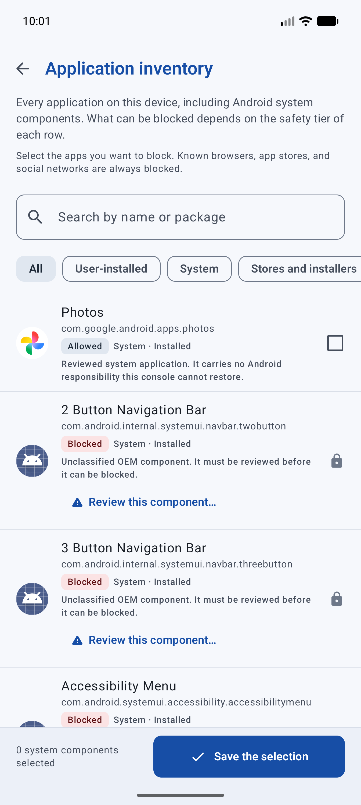
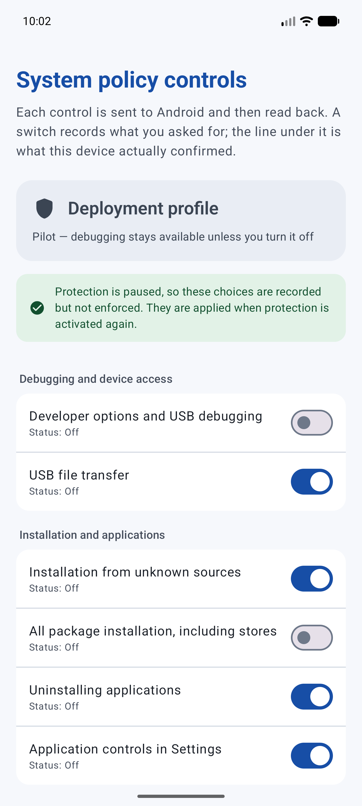
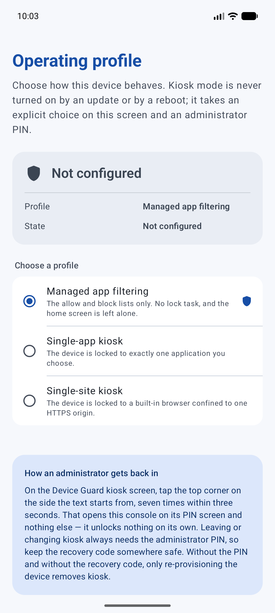
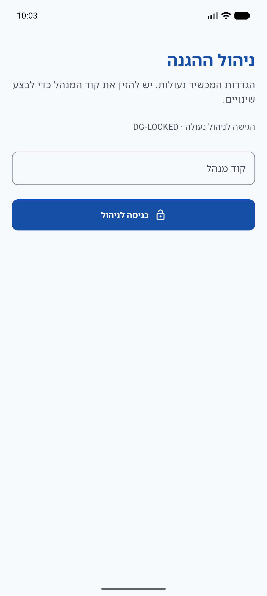

# Device Guard for Android

**Open-source Android Device Owner (DPC) for verified app allowlisting, system-app controls, secure kiosk mode, and signed self-updates.**

[](https://github.com/ShalomMaman/android-lockdown-dpc/actions/workflows/android-ci.yml)
[](https://github.com/ShalomMaman/android-lockdown-dpc/releases)
[](LICENSE)
[](https://developer.android.com/about/versions/oreo)

[Download the current pilot APK](https://github.com/ShalomMaman/android-lockdown-dpc/releases) · [Provision a test device](docs/provisioning.md) · [See the production roadmap](docs/production-roadmap.md) · [Report a vulnerability](SECURITY.md)

> [!IMPORTANT]
> The currently published Device Guard build is a public pilot, not a production-certified mobile device management product. Device Owner enrolment can require a factory reset, and kiosk or system-policy changes can make a test device difficult to recover. Use a dedicated test device and read the [deployment boundary](#project-status) before provisioning.

Device Guard turns a dedicated Android phone or tablet into a locally managed device. An authorized administrator chooses which applications remain available, controls selected Android system capabilities, or locks the device to one application or one website. Policy is protected by a local administrator PIN and is verified after Android applies it; a partial result is never presented as successful protection.

The project is local-first and open source. It has no analytics service, no advertising SDK, and no required management cloud. English is the default interface, with a complete Hebrew translation and right-to-left layout.

## Product tour

<table>
  <tr>
    <td align="center" width="50%">
      
      <br><sub>Verified administrator dashboard and protection state</sub>
    </td>
    <td align="center" width="50%">
      
      <br><sub>Searchable user and system application inventory</sub>
    </td>
  </tr>
  <tr>
    <td align="center" width="50%">
      
      <br><sub>System controls with requested-versus-confirmed status</sub>
    </td>
    <td align="center" width="50%">
      
      <br><sub>Managed filtering, single-app kiosk, and single-site kiosk</sub>
    </td>
  </tr>
</table>

<p align="center">
  
  <br><sub>Complete Hebrew localization and right-to-left management flow</sub>
</p>

These are unedited screen captures from the current `main` development build running as Device Owner on an Android API 37.1 emulator. The debuggable build was used because release builds intentionally block screenshots with `FLAG_SECURE`. They demonstrate the real interface, not physical-device certification; firmware-specific evidence remains in the [device matrix](docs/device-matrix.md).

## What can it manage?

| Profile | Intended use | Enforcement |
| --- | --- | --- |
| Managed app filtering | A restricted phone or tablet with an administrator-selected app set | Blocklist or strict allowlist, known browser/store/social-app rules, and reviewed system-app controls |
| Single-app kiosk | School displays, check-in stations, point-of-sale, or other dedicated devices | Android Lock Task, controlled HOME behavior, escape-surface blocking, and PIN-protected administration |
| Single-site kiosk | Dashboards, information displays, lessons, forms, or digital signage | Full-screen WebView constrained to one configured HTTPS origin |

Kiosk mode is opt-in. Installing an update or rebooting a device never enables kiosk by itself.

## Why Device Guard?

- **Verified policy state.** Restrictions, package visibility, uninstall blocking, WebView availability, link routing, and supported system controls are read back from Android. The console reports `active` only after the critical policy is confirmed.
- **A safer application inventory.** Administrators can search user and system applications. Protected Android components cannot be blocked; reviewed system applications can; unknown OEM components require explicit risk acceptance.
- **Recovery-aware administration.** A 6–12 digit PIN, progressive lockout, one-time recovery code, short administrator sessions, audited maintenance windows, and deliberate break-glass choices protect management operations.
- **Signed self-updates.** The pilot channel verifies ECDSA metadata, HTTPS redirects, package identity, version, file size, SHA-256 digest, APK signer, and signing lineage before installation.
- **Lifecycle reconciliation.** Policy is re-checked after reboot, application update, package installation, and Device Admin service reconnection.
- **Bilingual and bidirectional.** English and Hebrew resources, placeholders, plural rules, and RTL/LTR behavior are checked for parity in CI.

See [package reconciliation](docs/package-reconciliation.md), [secure updates](docs/secure-updates.md), [kiosk mode](docs/kiosk-mode.md), and the [production roadmap](docs/production-roadmap.md) for the full security model and its limits.

## Pilot quick start

### Requirements

- Android 8.0 or newer (`minSdk 26`).
- A dedicated test device that can be provisioned as Device Owner.
- ADB for the development path, or a tested provisioning payload for setup-wizard enrolment.
- JDK 17 and the Android SDK when building from source.

### Download or build

The current public test artifact is listed on [GitHub Releases](https://github.com/ShalomMaman/android-lockdown-dpc/releases). The signed [`latest.json`](updates/pilot/latest.json) channel record binds the exact version, APK URL, size and SHA-256 digest that enrolled pilot devices accept. Verify the release details before installing it.

To build an ordinary development artifact with remote updates intentionally disabled:

```bash
export JAVA_HOME="/path/to/jdk-17"
export ANDROID_HOME="/path/to/android-sdk"
./gradlew assembleDebug lintDebug test
```

The explicitly gated pilot-channel build is:

```bash
./gradlew -I gradle/pilot-update.init.gradle.kts \
  --no-daemon --max-workers=2 clean pilotChannelRelease
```

### Provision a development device

`set-device-owner` is intended for a clean test device. Never run it on a personal device or a device containing important data.

```bash
adb install -t app/build/outputs/apk/debug/app-debug.apk
adb shell dpm set-device-owner \
  com.example.lockdowndpc/.admin.LockdownAdminReceiver
```

Open Device Guard, create an administrator PIN, store the recovery code away from the device, choose a policy profile, and apply protection. For repeatable deployments and QR enrolment constraints, follow the [Device Owner provisioning runbook](docs/provisioning.md).

## Security boundary

Device Guard uses Android's official Device Owner and Device Policy APIs. It does not use Accessibility to simulate control, and it does not claim to make consumer hardware impossible to reset or reflash.

- Never commit APK-signing keys, update-metadata keys, administrator PINs, recovery codes, device credentials, or customer data.
- Keep ADB available until the signed on-device update and recovery drill has passed on the exact firmware family being deployed.
- Recovery-mode reset or firmware flashing can remove a DPC. Deployments with hostile physical access also need verified boot-chain and hardware assumptions.
- OEM firmware behavior varies. A pass on an emulator or one device model does not prove another model.
- The normal build retains the pilot identity and embeds no update channel. Production requires a final application ID, an externally protected signing key, and the separate [production release procedure](docs/production-release.md).

Security issues belong in the private process described in [SECURITY.md](SECURITY.md), not in a public Issue.

## Project status

Current public release: the pilot shown by the release badge above and recorded in the signed [`latest.json`](updates/pilot/latest.json) channel. It keeps the existing pilot application ID and signer so already enrolled pilot devices can update in place. The protected release process builds and signs the APK, rehearses the offline update, publishes the prerelease, merges its signed channel metadata and verifies the public read-back.

The core implementation, JVM tests, emulator work, static analysis, lint, release build, offline update drill, and signed public update metadata are in place. Production readiness still depends on real-device evidence: provisioning, policy application, kiosk containment, reboot recovery, timed maintenance restoration, and a higher-version self-update must pass on every supported firmware family. The evidence ledger is [docs/device-matrix.md](docs/device-matrix.md); untested cells remain explicitly untested.

| Release stage | Meaning |
| --- | --- |
| Current public pilot | Features implemented, protected publication and automated checks passing; dedicated-device evidence is still incomplete |
| Hardware validation phase | Complete the physical-device, provisioning, kiosk, recovery, and signed-update gates for every supported firmware family |
| 1.0 production candidate | Freeze the production identity and external signing process, then support only device/firmware combinations with recorded evidence |

Follow the [production roadmap](docs/production-roadmap.md), [hardware validation procedure](docs/hardware-validation.md), [device matrix](docs/device-matrix.md), and [update drill](docs/update-drill.md) for the exact gates.

## Documentation

| Topic | Document |
| --- | --- |
| Product boundary and release sequence | [Production roadmap](docs/production-roadmap.md) |
| Device Owner setup and QR/ADB paths | [Provisioning](docs/provisioning.md) |
| Application policy and fail-closed reconciliation | [Package reconciliation](docs/package-reconciliation.md) |
| Single-app and single-site containment | [Kiosk mode](docs/kiosk-mode.md) |
| Signed remote update design | [Secure updates](docs/secure-updates.md) |
| One-approval pilot publication | [Protected pilot release automation](docs/pilot-release-automation.md) |
| Physical-device acceptance procedure | [Hardware validation](docs/hardware-validation.md) |
| Supported-device evidence | [Device matrix](docs/device-matrix.md) |
| Public positioning and discoverability | [Project positioning](docs/project-positioning.md) |

## Contributing

Contributions, device-test evidence, documentation improvements, OEM compatibility reports, and security-focused review are welcome. Read [CONTRIBUTING.md](CONTRIBUTING.md) before opening a pull request. Large policy or architecture changes should start with an Issue so recovery and migration effects can be reviewed first.

Device Guard is licensed under the [Apache License 2.0](LICENSE).
