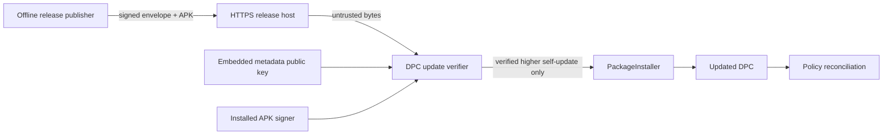

# Security Hardening Proposal: Secure remote update boundary

## Decision

The user selected an application-owned signed update channel so routine upgrades no longer depend on ADB. We will implement Option 2 while keeping Option 3 available when centralized fleet operations become the dominant requirement.

## Executive Recommendation

The complete option set is: **Option 1 — Manual ADB updates**, **Option 2 — Signed self-update**, and **Option 3 — Managed Google Play/EMM**. I recommend Option 2 under the current small-fleet and Android 9 constraints because it removes the recurring local-computer step without requiring an enterprise control-plane subscription. Option 3 becomes preferable when device inventory, staged rollout, compliance reporting, and administrator separation justify the service dependency.

## Evidence

| Evidence | Finding or document | What it establishes |
| --- | --- | --- |
| `E001` | Current DPC source | No update boundary exists today; ADB is the only upgrade path. |
| `E002` | Pilot/production signing configuration | Package identity and signing certificate are compatibility invariants. |
| `E003` | Android PackageInstaller session contract | Device Owner installation can be silent and completion is asynchronous. |
| `E004` | Android dedicated-device cookbook | PackageInstaller is the supported private-app install mechanism for fully managed devices. |
| `E005` | Rebooted Diofox M8 observation | ADB TCP closes after reboot on this Android 9 device. |

## Current Design And Failure Mode

Observed: policy reconciliation runs locally after boot and package changes, while upgrades arrive through an operator-controlled ADB session. Inferred: operational availability is coupled to a privileged debug transport whose lifetime is controlled by the OS. The protection itself survives a reboot, but our ability to deliver a fix does not. Permanently exposing ADB would trade availability for a much larger remote-debug surface.

## Desired Invariants

- A release host alone cannot authorize executable code.
- Only a strictly higher version of the current package can be staged.
- Authorized size and SHA-256 must match the downloaded bytes before parsing or installation.
- The APK signer must match the installed DPC signer before `PackageInstaller` receives bytes.
- Update failure never disables, pauses, or weakens the current protection policy.
- Installation completion is recorded from the platform callback, not inferred from a download.
- Missing endpoint/key configuration disables remote update rather than accepting unsigned metadata.

## Constraints And Non-Goals

Android 9 is required. The pilot package cannot silently become the separate production identity; that remains a re-provisioning migration. We will not embed GitHub/cloud credentials, implement arbitrary-app installation, or make the update host a general remote-command channel. We also will not keep ADB open permanently.

## Before Architecture

Source: [before diagram](../diagrams/secure-update-boundary-before.mmd).

## Options

### Option 1: Manual ADB updates

This preserves the current implementation and has the smallest code footprint. Its strongest case is controlled pilot work where a technician already touches every device. Android still enforces the APK signing certificate, but transport availability and operator authentication remain outside the DPC. A reboot can close the path, and opening it again requires a nearby computer.

| Change | Before | After | Security consequence | Cost |
| --- | --- | --- | --- | --- |
| Update path | ADB | ADB | No new attack surface, but debug transport remains operationally necessary | Technician time per reboot/update |

Rollback is simply continued use of the existing path. Residual risk is delayed patch delivery when no technician can reopen ADB.

### Option 2: Signed self-update

The DPC periodically fetches a bounded HTTPS envelope. A distinct offline metadata key signs the raw payload; the payload authorizes one package, monotonic version, byte length, digest, and HTTPS APK URL. Only after those checks does the client compare the archive signer to its installed signer and stream the file into a self-update-only `PackageInstaller` session.

The attractive property is defense in depth: TLS protects transport, the metadata signature protects release authorization even if hosting is modified, digest/length bind the exact bytes, Android signing binds app identity, and Device Owner authority removes user prompts. What gives me pause is key operations: a lost metadata key blocks releases, while a stolen key still cannot bypass the APK signing certificate but can cause repeated failed download attempts. We therefore need offline-key backup, bounded retries, and observable status.

| Change | Before | After | Security consequence | Cost |
| --- | --- | --- | --- | --- |
| Authorization | Operator chooses APK | Offline key authorizes immutable release metadata | Hosting compromise cannot substitute an unsigned release | Key ceremony and backup |
| Installation | ADB install | Device Owner PackageInstaller session | Removes persistent debug dependency | Client state machine and callback handling |
| Failure | Operator notices command failure | Stored state and audit entry | Deterministic fail-closed behavior | Small disk/network/background budget |

Rollback uses a newly signed higher-version release; Android downgrade remains prohibited. If the updater itself misbehaves, ADB remains the break-glass channel during the pilot.

### Option 3: Managed Google Play/EMM

An EMM owns release targeting, staged rollout, reporting, and managed app distribution. This is the strongest operational option for a fleet because administrator identity, inventory, and rollout policy move into a purpose-built control plane. Android/Play still enforce app signing.

The tradeoff is dependency and enrollment complexity. It may also require migrating the current pilot identity and re-provisioning devices. I would choose it once centralized compliance and staged rollout are more valuable than a small self-hosted release protocol.

| Change | Before | After | Security consequence | Cost |
| --- | --- | --- | --- | --- |
| Control plane | Technician + ADB | Enterprise identities and managed distribution | Stronger administrative separation and fleet visibility | Subscription/onboarding/vendor dependency |

Rollback and staged rollout are control-plane functions, but migration away from an EMM can be materially harder than disabling our self-update endpoint.

## Comparison

| Dimension | Option 1: ADB | Option 2: Signed self-update | Option 3: EMM |
| --- | --- | --- | --- |
| Security | Narrow when closed; privileged when opened | Improves release authorization and removes routine debug exposure | Strongest administrative separation |
| Performance | No background cost | Small periodic request; bounded APK download only for newer versions | Vendor-dependent background behavior |
| Memory | Neutral | One worker and bounded streaming buffers | Vendor agent dependent |
| Reliability | Technician and reboot dependent | Automatic retry; hosting/key dependency | Vendor/service dependency with fleet tooling |
| Operability | Manual per device | Key, release manifest, audit state | Central console, enrollment, subscription |
| Migration | None | Incremental bootstrap update | Potential re-provisioning and identity migration |

These effects are source-derived or hypothetical, not measured. We will measure check duration, downloaded bytes, peak cache use, install success, and recovery after network/process interruption on Android 9 and a current emulator.

## Recommendation

I recommend Option 2 now. It matches the user's selected direction and provides the largest reliability gain without turning a release host into a trusted arbitrary-code source. Option 1 remains the break-glass rollback path during the pilot. Option 3 should replace it when fleet governance becomes a first-class requirement.

## Evidence Coverage And Residual Risk

| Evidence | Effect | Tactical protection still required |
| --- | --- | --- |
| `E001` — No update client | Addresses | Keep ADB procedure documented until bootstrap validation completes |
| `E002` — Signing/identity split | Mitigates | Never claim pilot-to-production identity as an in-place update |
| `E003` — PackageInstaller callback | Addresses | Treat only final success callback as installed |
| `E004` — Fully managed silent install | Addresses | Verify Device Owner before creating a session |
| `E005` — ADB closes after reboot | Addresses | Tailscale remains maintenance connectivity, not update authority |

Residual risks are compromise/loss of the APK signing key, metadata-key operations, release-host availability, device storage exhaustion, and vendor-specific PackageInstaller behavior. The dual signature boundary limits but does not eliminate key-management risk.

## Migration And Rollout

Bootstrap the disabled-by-default updater through the existing ADB path. Validate manual check with a signed no-update envelope, bad signatures, digest mismatch, downgrade, and a real higher-version APK. Enable periodic checks only after the endpoint and public key are injected. Roll out to one device, observe one successful self-update and policy reconciliation, then expand. Disable polling by shipping an empty endpoint in a higher version or withdrawing the manifest; use ADB for emergency recovery.

## Validation Plan

- JVM tests for envelope parsing, signature verification, version monotonicity, digest and signer comparison helpers.
- Android instrumentation/emulator tests for PackageInstaller callbacks where supported.
- Android 9 physical test of one signed higher-version self-update.
- Network tests for offline, timeout, non-HTTPS URL, redirects, oversized metadata/APK, truncated body, and disk exhaustion.
- Confirm protection remains active throughout every failed check/install.

## Implementation Work Packages

- Build-time fail-closed update configuration.
- Signed-envelope parser and cryptographic verifier.
- Bounded downloader and APK identity/signer verifier.
- Device Owner self-update PackageInstaller coordinator and result receiver.
- Periodic native JobScheduler plus boot/rebind scheduling.
- Admin status/manual-check UI and audit entries.
- Offline publisher tool and release runbook.

## Open Questions

- Which HTTPS endpoint will host the stable channel?
- Where will the offline metadata private key and its backup live?
- At what fleet size should we migrate to Android Enterprise/EMM?

